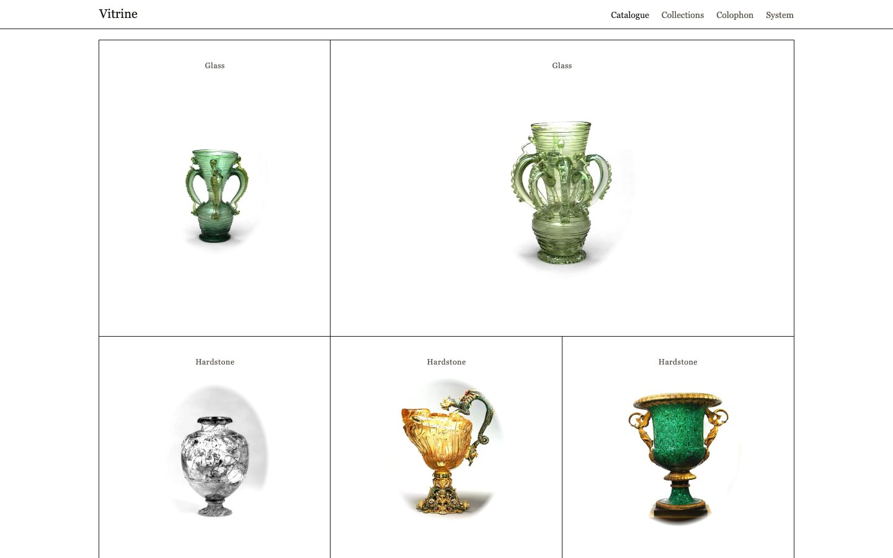

# Vitrine

A catalogue raisonné for the web. An Astro theme for archives, collections and bodies of
work that are made of objects: one plate per object, set inside a ruled grid, with the
label underneath. Free and MIT-licensed.

[Live demo](https://vitrine-free.ondelva.com) · [Pro demo](https://vitrine.ondelva.com) · [Get Pro](https://buy.polar.sh/polar_cl_z7WP4LpiFkzsqqsbn6nQ9tCRmEhqJhuDhHKKC3mxEzz)



## What it is

The page is a printed sheet rather than a card layout. A 1px rule runs through the grid
and the objects sit _inside_ the cells instead of filling them, the way a plate sits on a
page. Each cell carries a caption above and a cartellino — medium, date, catalogue
number — below, and the plate cell stays paper in dark mode, because a photograph shot on
white cannot sit on a dark page without becoming a white rectangle.

Nothing is rounded, nothing glows, and the only button inverts.

## Features

- Astro 7 + Tailwind CSS v4, static output, no client-side framework
- The plate grid: rules, cartellini and double-width cells, all CSS
- Home, catalogue with pagination, collections, object entries, colophon, contact,
  privacy, terms and 404
- Type-safe content collections: objects and collections, checked at build time
- Dark mode, responsive from 360px
- Contrast measured, not eyeballed — `pnpm check:contrast` fails on any pair below WCAG AA
- Meta, Open Graph, JSON-LD, RSS, sitemap, `robots.txt`, and an analytics slot
  (Plausible, GA4, Umami)
- Lighthouse 95+ on all four categories across the demo pages, checked in CI
- `AGENTS.md` for Claude Code / Cursor

## Quick start

You need Node.js 22.12+ and pnpm 9 or newer (`npm i -g pnpm`). `package.json` pins the
exact pnpm version, and pnpm 10+ switches to it on its own.

```sh
pnpm create astro@latest my-archive -- --template ondelva/astro-theme-vitrine
cd my-archive
pnpm install
pnpm dev
```

`pnpm dev` also serves `/styleguide`, where every colour token, the type scale and the
plate grid are on one page. It is a dev-only route and is never built.

## Configure

Everything site-specific lives in `src/config.ts`: name, URL, author, navigation, social
links, the contact endpoint, pagination and the feature switches. Colours, type and the
plate metrics are tokens you override in `src/styles/theme.css`.

- [docs/customization.md](docs/customization.md) — every config group, the tokens, the switches
- [docs/content.md](docs/content.md) — the two collections and every field
- [docs/deploy.md](docs/deploy.md) — build, hosting, CI

## Content

- `src/content/objects/*.mdx` — one file per object: title, image, caption, date, medium,
  collection. The body of the file is the note printed beside the label.
- `src/content/collections/*.md` — the archive's own divisions, arranged by `order`.

Images go in `src/assets/objects/` and are resized at build time. The 23 sample
photographs come from the Metropolitan Museum's Open Access collection (CC0); delete them
when you start your own archive.

## Scripts

```sh
pnpm dev             # dev server, /styleguide included
pnpm build           # static site into dist/
pnpm preview         # serve dist/
pnpm check           # astro check — types and templates
pnpm check:contrast  # every colour pair against WCAG AA, both modes
pnpm lint
pnpm format
```

`pnpm check && pnpm build` is the gate to run after any change.

## Deploy

Static output. Works on Cloudflare, Vercel, Netlify and GitHub Pages. One click and the
host clones this repository into your account, builds it and puts it online:

[](https://deploy.workers.cloudflare.com/?url=https://github.com/ondelva/astro-theme-vitrine)
[](https://app.netlify.com/start/deploy?repository=https://github.com/ondelva/astro-theme-vitrine)
[](https://vercel.com/new/clone?repository-url=https://github.com/ondelva/astro-theme-vitrine)

Set `SITE_URL` to your address afterwards. See [docs/deploy.md](docs/deploy.md).

## Free vs Pro

This edition is a finished archive: the plate grid, the catalogue, the collections and the
entries. Pro is the rest of the printed catalogue — the apparatus, the second axis and the
ways in. See it running at [vitrine.ondelva.com](https://vitrine.ondelva.com), and
[buy it here](https://buy.polar.sh/polar_cl_z7WP4LpiFkzsqqsbn6nQ9tCRmEhqJhuDhHKKC3mxEzz) — $49 for one person, $129 for a
team of up to ten.

|                   | Free (this repo)                                                    | Pro                                                                           |
| ----------------- | ------------------------------------------------------------------- | ----------------------------------------------------------------------------- |
| Pages             | Home, catalogue, collections, object, colophon, contact, legal, 404 | + index of terms, chronology, search                                          |
| Second axis       | –                                                                   | Index terms across collections, `/index/` and `/index/<term>/`                |
| Search            | –                                                                   | Pagefind index, `/search`, and a finder on the catalogue and collection grids |
| Plates per object | One                                                                 | Further captioned plates, enlargement dialog, plates ↔ register view          |
| Apparatus         | –                                                                   | Provenance, exhibition and literature registers; footnotes; section essays    |
| Colour presets    | 1                                                                   | 4                                                                             |
| Share cards       | The object's own plate                                              | A card drawn per object at build time                                         |
| License           | MIT                                                                 | Commercial, unlimited end products                                            |
| Footer credit     | One line, easy to remove                                            | None                                                                          |
| Support           | GitHub Issues                                                       | Email (im@ondelva.com), 2 business days                                       |

## Support

[GitHub Issues](https://github.com/ondelva/astro-theme-vitrine/issues). No response time is
promised; Pro is where support is part of the price.

## Screenshots

More in [docs/screenshots/](docs/screenshots/): the home sheet, the catalogue and an
entry, light and dark, desktop and mobile.

## License

MIT, see [LICENSE](LICENSE).
Third-party assets: [THIRD-PARTY-NOTICES.md](THIRD-PARTY-NOTICES.md)
